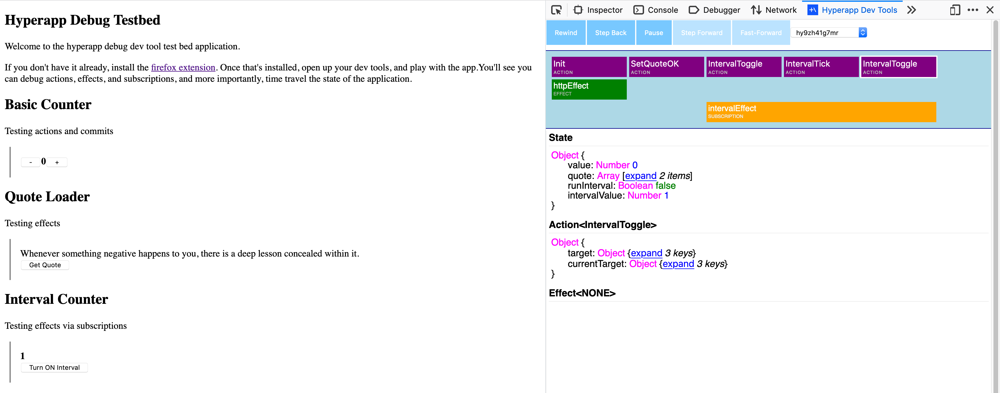

#  Hyperapp Debug

[](https://addons.mozilla.org/en-US/firefox/addon/hyperapp-debug-dev-tools/)
[](https://travis-ci.org/mrozbarry/hyperapp-debug)
[](https://www.npmjs.com/package/hyperapp-debug)
[](https://hyperappjs.herokuapp.com "Join us")



A debugger for your [Hyperapp](https://github.com/hyperapp/hyperapp) applications.

## What is it

[hyperapp-debug](https://github.com/mrozbarry/hyperapp-debug) is a browser extension and higher-order app wrapper for your hyperapp applications.
It is a tool similar to redux-dev-tools or vue-dev-tools, with tighter integration to the Hyperapp paradigm.
To debug your application, you must install the browser extension. Don't worry, I don't collect any information at all, and the addon will always be free.

## Hyperapp V1

If you are debugging Hyperapp V1 applications, check out [the legacy debugger](https://github.com/mrozbarry/hyperapp-debug/tree/hyperapp-v1-debugger).

## Installation

Install with npm or Yarn.

<pre>
npm i <a href=https://www.npmjs.com/package/hyperapp-debug>hyperapp-debug</a>
</pre>

Then with a module bundler like [Rollup](https://rollupjs.org) or [Webpack](https://webpack.js.org), use as you would anything else.

```js
import { app, h } from 'hyperapp';
import withDebug from 'hyperapp-debug';
```

Or with `<script type="module">` and unpkg:

```js
import { app, h } from 'https://unpkg.com/hyperapp?module=1';
import withDebug from 'https://unpkg.com/hyperapp-debug?module=1';
```

If you don't want to set up a build environment, you can download Hyperapp Debug from a CDN like [unpkg.com](https://unpkg.com/hyperapp-debug), and it will be globally available through the <samp>window['hyperapp-debug'].default</samp> object.
hyperapp-debug supports all ES5-compliant browsers, including Internet Explorer 10 and above.

```html
<head>
  <script src="https://unpkg.com/hyperapp"></script>
  <script src="https://unpkg.com/hyperapp-debug"></script>
</head>
<body>
  <script>
    const { app, h } = window.hyperapp;
    const withDebug = window['hyperapp-debug'];
    // Your code here...
  </script>
</body>
```

## Usage

Use <samp>debug</samp> to wrap Hyperapp's <samp>app</samp> function.

```js
import { app } from 'hyperapp';
import withDebug from 'hyperapp-debug';

withDebug(app)({
  init: {},
  view: () => null,
  subscriptions: () => [],
  node: document.getElementById('your-app'),
});
```

The debugger will only work if you also install the Firefox/Chrome Extension.

## History

For those coming from the elm community, you may notice much inspiration from Elm's time-travelling debugger :heart:.

## Contributing

Check out the [CONTRIBUTING.md](./CONTRIBUTING.md) guidelines for more information.

## License

Hyperapp Debug is MIT licensed. See [LICENSE.md](LICENSE.md).

## Other similar tools

 - [hyperapp-redux-devtools](https://github.com/andyrj/hyperapp-redux-devtools)
 - [hyperapp-devtools](https://github.com/hyperstart/hyperapp-devtools)
